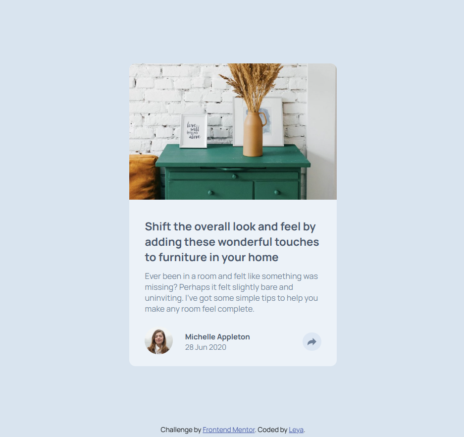
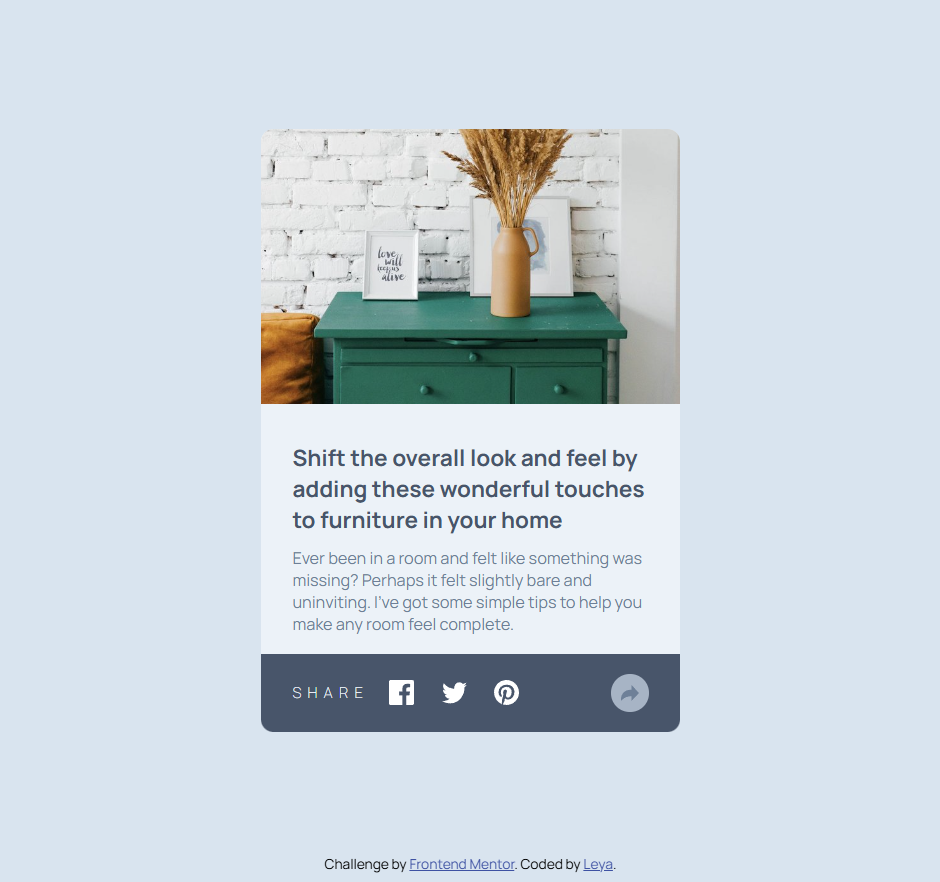
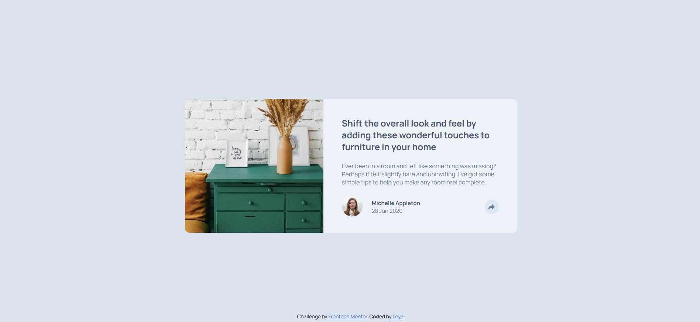
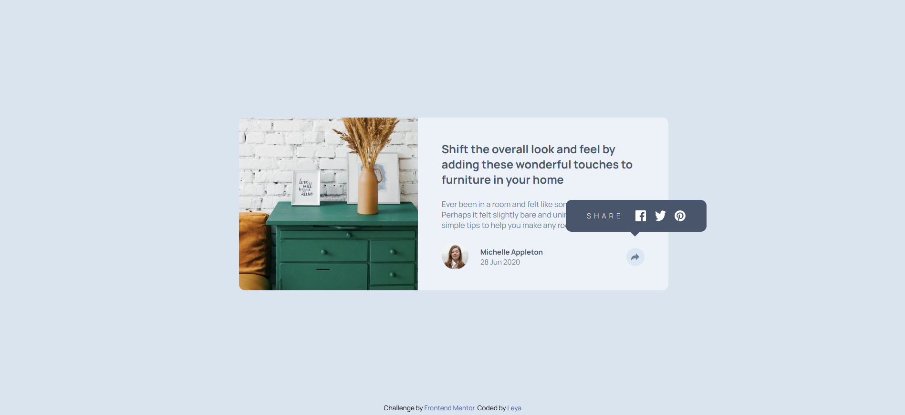

# Frontend Mentor - Article preview component solution

This is a solution to the [Article preview component challenge on Frontend Mentor](https://www.frontendmentor.io/challenges/article-preview-component-dYBN_pYFT).

## Table of contents

- [Overview](#overview)
  - [The challenge](#the-challenge)
  - [Screenshot](#screenshot)
  - [Links](#links)
- [My process](#my-process)
  - [Built with](#built-with)
  - [What I learned](#what-i-learned)
  - [Continued development](#continued-development)
  - [Useful resources](#useful-resources)
- [Author](#author)

## Overview

### The challenge

Users should be able to:

- View the optimal layout for the component depending on their device's screen size
- See the social media share links when they click the share icon

### Screenshot






### Links

- Solution URL: [Add solution URL here](https://www.frontendmentor.io/solutions/article-preview-using-javascript-VZF7pFC1y7)
- Live Site URL: [article preview component](https://minleya.github.io/article-preview-component/)

## My process

### Built with

- Semantic HTML5 markup
- CSS custom properties
- Flexbox
- JavaScript
- Mobile-first workflow


### What I learned

Firstly, I learned new way to add JS file to HTML.

```html
<script src="scripts/script.js" defer></script>
```

Secondly,  I learned about the filter in CSS.

```css
.share-icon-container.active .share-icon-2 {
  filter: brightness(0) invert(1);
}
```

Thirdly, used event handling in practice.

```js
const button1 = document.querySelector("#button-1");
const button2 = document.querySelector("#button-2");
const authorInfo = document.querySelector(".author-info");
const activeState = document.querySelector(".active-state");

button1.addEventListener("click", function () {
  const isActive = activeState.classList.toggle("active");

  if (window.innerWidth < 1400) {
    authorInfo.style.display = isActive ? "none" : "";
  } else {
    button2.style.display = isActive ? "none" : "";
  }
});
```

### Continued development

I want to continue using JavaScript in future projects.

### Useful resources

- [Frontend Mentor Handling user events Article](https://www.frontendmentor.io/learning-paths/javascript-fundamentals-oR7g6-mTZ-/article/660eb6a32f40450f917475d2/read) - This is an article which helped me finally understand how to use handle user events.

## Author

- GitHub - [minLeya](https://github.com/minLeya)
- Frontend Mentor - [@minLeya](https://www.frontendmentor.io/profile/minLeya)